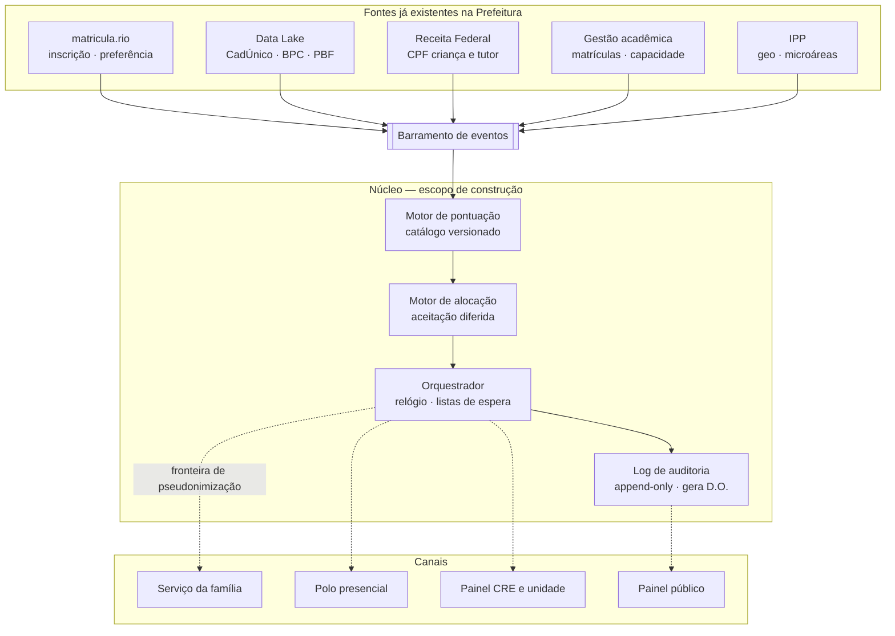
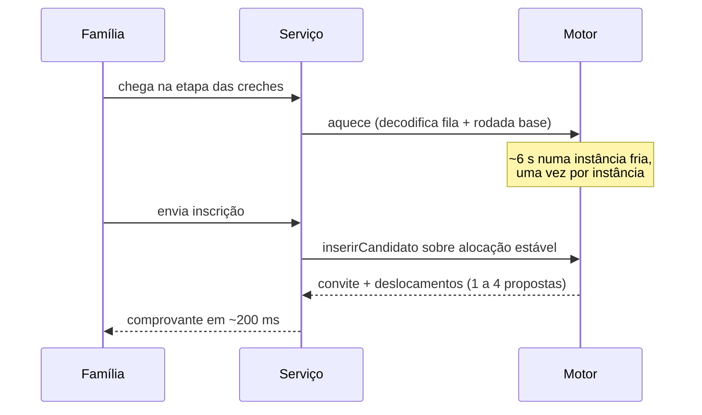
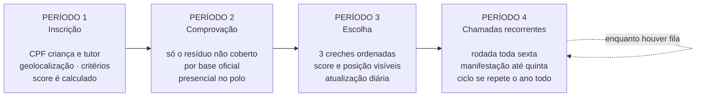
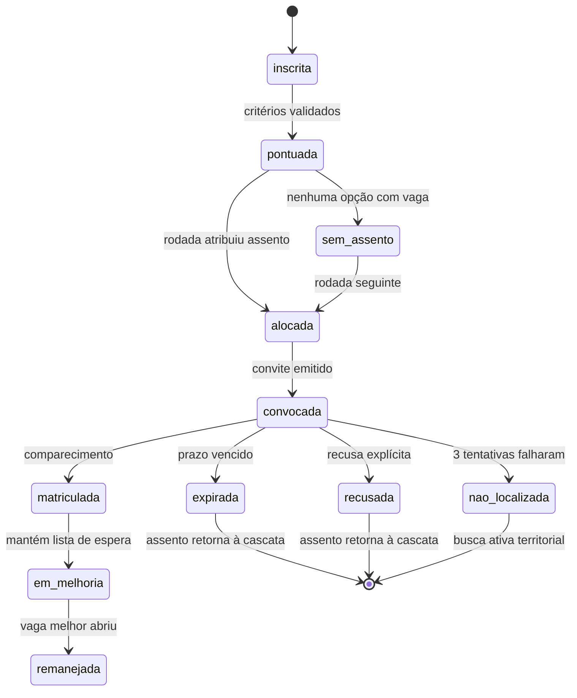

# TDD — Motor de alocação e serviço de inscrição em creche · SME Rio

| Campo | Valor |
| --- | --- |
| Equipe | Seed 33 (grupo 33) |
| Membros | Camila Nascimento, João Assumpção, Pedro Moradillo, Lucas Tosto |
| Contexto | Claude Impact Lab Rio — Eixos 2 e 3 |
| Aplicação | https://grupo33-hackathon.vercel.app |
| Repositório | https://github.com/LucasTosto/grupo33_hackathon |
| Status | Rascunho — V1 implementada e verificada; V2 especificada, não construída |
| Criado | 2026-08-30 |
| Última atualização | 2026-08-30 |
| Processo de referência | `prm_id 195` (2025) · Resolução SME nº 542 |

> **Como ler este documento.** A seção 4 separa o que **já está implementado, testado e no ar** (V1)
> do que está **especificado mas não construído** (V2/V3). Toda afirmação numérica sobre V1 é
> reproduzível pelos scripts do repositório; toda afirmação sobre V2 é projeto, não medição. A
> seção 6 reconcilia as divergências numéricas entre este documento e os documentos de solução
> anteriores.

---

## 1. Contexto

### Situação atual

A inscrição em creche da rede municipal do Rio processa cerca de 72 mil inscrições por processo
seletivo, distribuídas em 11 Coordenadorias Regionais de Educação e mais de 800 unidades. O fluxo
tem três fases manuais e a convocação é feita por telefone, unidade por unidade, com prazo de três
dias úteis por convite.

O problema central não é capacidade computacional. É que **o sistema classifica escolhas, não
crianças**: uma inscrição com cinco opções gera cinco posições de fila independentes para o mesmo
CPF. A criança recebe até cinco ofertas, ocupa até cinco assentos, aceita um — e os outros ficam
congelados até serem repassados. Enquanto o relógio corre, existe simultaneamente uma vaga ociosa e
uma criança esperando.

### Domínio

Educação infantil municipal — matrícula em creche (Berçário, Maternal I, Maternal II), regida pela
Resolução SME nº 542 e pelo edital de cada processo seletivo. O grupamento é derivado da data de
nascimento com corte em 31 de março.

### Partes interessadas

| Parte | Interesse |
| --- | --- |
| Família | Saber a posição na fila, receber um convite que dá para aceitar, não perder a vaga por não ter conseguido comprovar |
| Direção da unidade | Sair do caminho crítico da convocação — hoje o diretor é operador de telefonema |
| CRE | Ver ociosidade e pressão de demanda em tempo real, tratar exceção em vez de operação |
| Gerência de Matrícula / SME | Executar a Resolução como está escrita, com resultado defensável |
| Órgãos de controle | Refazer a classificação de forma independente e chegar ao mesmo resultado |
| Planejamento de rede | Saber onde abrir vaga, com base em demanda territorial observada |

---

## 2. Definição do problema e motivação

### Problemas que estamos resolvendo

**P1 — Assentos retidos por oferta simultânea.**
No processo de 2025, 7.256 crianças ocuparam mais de um assento ao mesmo tempo, retendo **11.926
assentos** que ninguém mais podia disputar enquanto o prazo corria.
*Impacto:* 11.926 vagas indisponíveis por até 3 dias úteis cada, em cascata.

**P2 — A régua de pontuação praticamente não classifica.**
68,2% das inscrições declararam ao menos um critério de prioridade, mas apenas 6,2% chegaram à
classificação com pontuação acima de zero.

> **Formulação obrigatória deste achado.** No campo que a extração expõe como comprovação, **62% de
> todas as inscrições declararam critério e aparecem com zero ponto** (44.650 de 71.949). Ou é perda
> real de pontuação, ou a validação automática não está sendo registrada de forma auditável. **Não
> sabemos qual** — é a primeira pergunta para a equipe de dados da SME (Q7), e a solução resolve os
> dois casos: se é perda real, o funil de comprovação automática (F3) recupera; se é registro, a
> rodada versionada passa a deixar rastro auditável por critério.
>
> O denominador importa: dito sobre os declarantes, o número seria **90,9%**, não 62%. Este documento
> usa sempre o total de inscrições. O campo `confirmado` é uniforme dentro da inscrição em 96,7% dos
> casos, o que é compatível com as duas leituras e por isso não decide entre elas.

*Impacto, e este não depende da resposta a Q7:* **67.505 inscrições (93,8%) entram na fila empatadas
em zero ponto.** Quem ordena a fila, na prática, é o critério de desempate — e ele não é publicado
nem reproduzível hoje.

**P3 — Reservas que não viram matrícula.**
66.686 assentos foram reservados em algum momento do processo de 2025 para 48.688 matrículas
efetivadas. A diferença — **17.998 reservas** — é capacidade que circulou pelo sistema sem produzir
atendimento.

**P4 — Convocação manual, em série.**
Cada convite consome três dias úteis de espera antes de o assento voltar à fila. O cálculo de quem
deve ser chamado, que um algoritmo resolve em milissegundos, é executado no mundo físico em semanas
de telefonema.

**P5 — Contato desatualizado descarta a família.**
Após três tentativas de telefone, a criança é descartada do processo. Há forte chance de ser
exatamente quem mais pontua em vulnerabilidade.

**P6 — Preferência declarada não é preferência real.**
A equipe da SME relata famílias escolhendo unidades por cálculo de chance, não por onde querem a
vaga. Em 2025, 48% das opções escolhidas ficavam em bairro diferente do da família, e a proporção
sobe com a posição na lista: 44,7% na 1ª opção, 58,0% na 5ª — com a taxa de matrícula caindo no mesmo
passo.

### Por que agora

- A base anonimizada de cinco processos (2021–2025) foi publicada, o que torna possível **medir** o
  ganho antes de tocar em produção.
- A lacuna entre declarar e comprovar é o que o próprio documento de parametrização da SME aponta
  como desafio central — e é atacável sem mudança normativa.
- O desempate, que hoje decide de fato a posição de 67 mil crianças, pode ser tornado público e
  reproduzível a custo quase nulo.

### Impacto de não resolver

- **Operacional:** a rede continua descobrindo em semanas de telefonema uma resposta que já estava
  contida nos dados no momento da inscrição.
- **Equidade:** a fila continua ordenada por um critério que ninguém publica, com 94% das crianças
  empatadas.
- **Jurídico:** a propriedade "ninguém à sua frente foi ultrapassado" hoje se defende com planilha e
  conferência manual, não com prova reproduzível.

---

## 3. Objetivos e não-objetivos

### Objetivos

1. Cada criança recebe **no máximo um convite** por rodada.
2. A ordem de prioridade da Resolução é executada **exatamente como está escrita** — nenhuma
   mudança de política.
3. A classificação é **reproduzível por terceiros** a partir de semente, catálogo versionado e hash
   das entradas.
4. Declarar a preferência verdadeira **nunca** reduz a chance da família.
5. Aceitar uma vaga **não fecha porta**: a matrícula é piso, não teto.
6. Vaga liberada durante o ano é redistribuída sem reprocessar a rede inteira.

### Não-objetivos

- Substituir o `matricula.rio` ou o sistema de gestão acadêmica.
- Alterar a régua de pontuação, os pesos ou os critérios da Resolução.
- Decidir política pública (peso do território, tempo de permanência mínima, rol de desempates).
- Otimizar desempenho computacional — a rodada inteira já roda em segundos. O gargalo é integração,
  auditabilidade e operação.

---

## 4. Escopo

### ✅ V1 — implementado, testado e no ar

Tudo abaixo está em produção em https://grupo33-hackathon.vercel.app, com 31 testes automatizados.

**Motor de alocação**
- Aceitação diferida com capacidades (Gale–Shapley, criança propõe).
- Prioridade lexicográfica: `pontuação da Resolução → critérios de desempate na ordem do catálogo → posição no sorteio`.
- Sorteio determinístico `HMAC(semente_do_processo, id_da_criança)`, semente única por processo.
- Rodada imutável com `rodada_id`, hash das entradas, semente e versão do catálogo.
- Verificação de estabilidade (ausência de par bloqueador) executada **junto com a rodada**, não só
  em teste.
- **Inserção incremental** de inscrição nova sobre alocação estável, com resultado idêntico ao da
  rodada completa (equivalência coberta por teste).
- **Cascata de vaga liberada** (rodada contínua), reprocessando apenas o fecho da cadeia.
- Agrupamento por criança: 71.949 inscrições → 62.899 crianças, porque a mesma criança pode estar
  inscrita em mais de um polo do mesmo processo.

**Catálogo de pontuação como dado versionado**
- As 13 perguntas do processo 195 com seus pesos, extraídas da base, com `catalogo_versao` gravada
  em cada rodada. Máximo 100 pontos; CadÚnico vale 51. Dois critérios de desempate: irmão
  matriculado (`perg_id 29`) e responsável menor de 18 anos (`perg_id 30`).

**Serviço para a família**
- Inscrição em 5 etapas: nascimento (grupamento derivado com corte de 31/03) → bairro → **até 5
  creches ordenadas** → 13 critérios → conferência.
- 831 unidades reais, ordenadas por distância ao centróide do bairro informado, com a concorrência
  observada de 2025 exposta por assento.
- Resultado como comprovante: protocolo, pontuação, `rodada_id`, convite ou posição, fila de
  melhoria e **lista de documentos a apresentar por critério marcado**.
- Consulta de inscrição, recalculada de forma determinística.

**Painel da rede**
- Identidade e garantias da rodada, ociosidade por assento, pressão de demanda por assento e por
  bairro, simulador de vaga liberada.

**Identidade visual**
- Manual de Marca Prefeitura Rio 2025, com as cinco cores oficiais e conformidade WCAG AA.

### 🔜 V2 — especificado neste documento, não construído

| Item | Origem | Consequência principal |
| --- | --- | --- |
| Quatro períodos sequenciais (inscrição → comprovação → escolha → chamadas) | Doc. de solução §1 | Separa pontuar de escolher; a família escolhe com score fechado |
| Desempate territorial por proximidade | Doc. de solução §2.3 | **Torna a prioridade dependente do assento** — ver §5.6 |
| Redução de 5 para 3 opções | Doc. de solução §4 | 94,2% de quem obteve vaga em 2021–2025 obteve numa das 3 primeiras |
| Lista de espera guarda uma opção só, escolhida pela família | Doc. de solução §5.1 | Substitui a fila de melhoria atual, que guarda todas as opções melhores |
| Rodada semanal com janela de manifestação | Doc. de solução §5 | Troca o modelo *push* (escola liga) pelo *pull* (família consulta) |
| Mapa de vacância com dois regimes | Doc. do mapa | Vaga sem fila vira autoatendimento; vaga com fila nunca é self-service |
| Validação automática de critérios via Data Lake | Doc. de solução §2.5 | Ataca P2 na raiz: presencial passa a ser exceção |
| Posição estimada ao vivo com as 4 mitigações | Doc. de solução §4.1 | Janela de estabilização, faixa em vez de número, posição nas 3, texto da mecânica |

### 🔮 V3 — futuro

- Nota de corte histórica por unidade, grupamento e turno ("com o seu score, você teria sido chamado
  em 3 dos últimos 4 anos"), calculável com 2021–2025.
- Porta de inscrição contínua para quem completa a idade fora do período.
- Busca ativa territorial a partir do estado `nao_localizada`, integrada a CRAS e agentes
  comunitários.
- Painel público de demanda por microárea, como insumo de planejamento de oferta.

### ❌ Fora de escopo

- Substituição do `matricula.rio` ou do sistema de gestão acadêmica.
- OCR de documentos. Documento enviado pela família só tem valor se carregar identificador
  consultável — nesse caso a prova é a consulta à base, não a imagem.
- Alteração de pesos ou critérios da Resolução.
- Multi-município.

---

## 5. Solução técnica

### 5.1 Visão de arquitetura



**Fronteira de pseudonimização.** O núcleo classifica sobre identificadores opacos. Dado pessoal só
cruza a linha no serviço de notificação. O motor não precisa saber quem é a criança para
classificá-la.

**Decisão: o motor é desacoplado.** É o que permitiu rodar em sombra sobre o processo de 2025 sem
tocar em produção — e é o que viabiliza adoção gradual.

### 5.2 O assento é a unidade de alocação

Vaga de creche não é fungível dentro de uma escola:

```
assento = (unidade, grupamento, horario)
horario ∈ { Integral, Parcial }
```

`horario` é `Integral`/`Parcial` — foi o que a base mostrou, não turno manhã/tarde. Em 2025: **2.114
assentos em 831 unidades**.

Capacidade que o motor deve enxergar em produção:

```
capacidade_disponível = capacidade_autorizada
                      − renovações_automáticas
                      − transferências_internas_efetivadas
```

Sem essa subtração, o motor aloca em assentos que a rede já comprometeu com quem está matriculado e
não pediu transferência. **V1 usa uma aproximação** — ver §6.

### 5.3 Prioridade (V1)

```
p(criança) = ( pontuação_da_resolução ,
               critérios_de_desempate_na_ordem_do_catálogo ,
               posição_no_sorteio )

posição_no_sorteio = HMAC(semente_do_processo, id_da_criança)
```

Comparação lexicográfica, da esquerda para a direita. A comparação é **total**: nunca devolve empate
entre identificadores distintos, o que garante determinismo.

**Semente única para todo o processo, nunca uma por unidade.** Sorteio único produz alocações mais
eficientes e, sobretudo, gera uma ordem que qualquer auditor com a semente e a lista de inscrições
reconstrói em uma linha de código.

Com 93,8% da fila empatada em zero, isto deixa de ser detalhe de implementação: **o desempate é o
alocador real do sistema.** Publicá-lo é, sozinho, um ganho de transparência maior que qualquer
melhoria de interface.

### 5.4 Aceitação diferida e as garantias

A criança propõe; o assento aceita provisoriamente os de maior prioridade e devolve o excedente, que
retoma a proposta na opção seguinte. Cada criança tenta cada opção no máximo uma vez, então o laço
termina em no máximo a soma dos tamanhos das listas de preferência.

Duas propriedades **verificadas a cada rodada**, não prometidas:

1. **Um convite por criança**, e nenhum assento acima da capacidade.
2. **Nenhum par bloqueador**: não existe par criança–assento em que a criança prefira aquele assento
   *e* ele esteja ocupado por alguém de prioridade menor. Na linguagem do edital: *ninguém à sua
   frente na fila foi ultrapassado.*

Consequência de (2): **declarar a preferência verdadeira nunca prejudica a família** — o que ataca
P6 de frente.

Como em V1 nenhum critério depende da unidade, a pontuação de uma criança é a mesma em todos os
assentos. Sob essa condição o resultado é idêntico a percorrer as crianças em ordem de prioridade,
cada uma tomando a melhor opção ainda disponível — o que torna o motor **trivialmente explicável**.

### 5.5 Rodada contínua: dois caminhos incrementais (V1)

O ponto que evita reprocessar 62.899 crianças a cada evento.

**Inscrição nova.** A criança propõe à 1ª opção; se está cheia, disputa com o ocupante de menor
prioridade; se passa, entra, e o deslocado retoma a proposta a partir da opção seguinte à que perdeu.
O resultado é **idêntico** ao de rodar a aceitação diferida com a nova criança na entrada — há teste
comparando as duas saídas candidato por candidato, em quatro perfis de inscrição, sobre instância de
600 candidatos.

**Vaga liberada.** Uma desistência inicia uma cadeia: o assento vai para a criança de maior
prioridade que o prefere ao que tem hoje; o assento que ela larga vai para a próxima; e assim até
chegar num assento que ninguém à espera prefere. A cadeia preserva a estabilidade — verificado em
teste sobre instância aleatória.



**Medições (2025, rede inteira):**

| Operação | Propostas avaliadas | Tempo |
| --- | --- | --- |
| Rodada completa | 94.387 | 3.766 ms |
| Verificação de estabilidade | — | 1.143 ms |
| Inscrição nova (incremental) | 1 a 4 | ~190 ms local · ~530 ms em produção |
| Vaga liberada (cascata) | 1.612 | 188 ms local · ~1,2 s em produção |

### 5.6 Desempate territorial (V2) — e o que ele custa

**Decisão dos documentos de solução:** a proximidade entra como **critério de desempate**, não como
pontos. A pontuação publicada no D.O. continua sendo a da Resolução, inteira e igual em todas as
unidades.

```
ordenação(criança, creche) = (
    pontuação_social ,          # inteiro, régua da Resolução 542
    desempates_da_Resolução ,   # irmão matriculado; responsável < 18 anos
    proximidade ,               # contínua, ver abaixo
    sorteio                     # semente publicada no D.O. antes da rodada
)

proximidade = max( f(d_residência) , α · f(d_trabalho) )
f(d)        = d_min(criança) / d(criança, creche)
d_min       = distância à creche mais próxima da criança
α           = 0,7
```

A razão `d_min/d` vale 1 na creche mais próxima da criança, esteja ela a 300 m ou a 3 km. Medir em
metros absolutos penalizaria em toda a cidade quem mora onde há pouca oferta — justamente os
territórios de maior demanda.

**Eficácia projetada** (calculável de forma exata na granularidade do CEP, sem estimar um metro:
duas crianças com o mesmo CEP têm distância idêntica a toda creche da cidade):

| Nível do vetor | Bloco de empate |
| --- | --- |
| Pontuação social | 67.486 |
| + desempates da Resolução | 41.798 |
| + proximidade, na cidade | 20,4 |
| + proximidade, na fila do assento | **4,15** |
| + sorteio | 1 |

52,6% das opções são resolvidas de imediato — a criança é a única com aquele CEP naquela fila. O
sorteio continua obrigatório, mas passa a decidir entre cerca de 4 crianças em vez de 42 mil.

#### ⚠️ Consequência arquitetural que precisa ser aceita antes de construir

A proximidade é **por creche**. Adotá-la muda a natureza da prioridade e não é um acréscimo barato:

| O que muda | Hoje (V1) | Com território (V2) |
| --- | --- | --- |
| Assinatura da comparação | `compara(a, b)` | `compara(a, b, assento)` |
| Chave de prioridade | Vetor pré-computado por criança | Vetor depende do par (criança, assento) |
| Equivalência com percorrer em ordem | Vale — base da explicação "trivialmente explicável" | **Deixa de valer globalmente**; passa a valer por assento |
| Testes de equivalência incremental | 4 perfis validados | Precisam ser refeitos sob prioridade por assento |
| Custo de memória | 62.899 chaves | 62.899 × 2.114 = 133 milhões de pares — **não materializar**; calcular sob demanda por assento |

A aceitação diferida **continua correta**: ela foi projetada para prioridades específicas por
assento, e é exatamente por isso que V1 a implementou em vez do atalho equivalente. A inserção
incremental e a cascata também seguem válidas em teoria — mas as provas de equivalência que hoje
sustentam V1 têm de ser reconstruídas.

**Explicabilidade.** A frase muda de "todos à sua frente na fila já haviam sido alocados" para
"todos à sua frente **na fila desta vaga** já haviam sido alocados". É uma frase pior de explicar em
balcão, e melhor de defender juridicamente.

**Limite de dados.** A base anonimizada removeu logradouro e número, deixando bairro e CEP. Toda a
validação acima mede o empate na granularidade do CEP, que é o **piso** do que a solução conseguirá
em produção — nunca o teto. Em produção há logradouro e número, e a microárea SME/IPP serve como
geografia intermediária onde o endereçamento é irregular.

### 5.7 Os quatro períodos (V2)



A mudança estrutural mais importante do desenho **não é nenhum algoritmo**. É a separação temporal
entre pontuar e escolher. Hoje a família escolhe até cinco unidades sem saber quanto vale, e
comprova depois. Na proposta, a criança entra na fase de escolha com um score fechado e verificado.

**Funil de comprovação (ataca P2).** A validação automática roda *durante* o Período 1. Só quem tem
critério não coberto por base oficial é convocado ao Período 2. Duas regras que precisam estar
explícitas no edital:

- **Perda por critério, não por inscrição.** Quem não comprova violência doméstica perde os 4 pontos
  daquele critério — não os 51 do CadÚnico, validados automaticamente. É o oposto do comportamento
  atual.
- **Atestação por serviço público, não por documento da família.** Para violência doméstica e uso
  abusivo de substâncias, a via correta é o CREAS, o CRAS ou a unidade de saúde registrarem no
  sistema. Exigir boletim de ocorrência cria barreira para quem tem medo de registrar.

**Posição estimada ao vivo** exige as quatro mitigações, sem exceção: janela de estabilização antes
da rodada; posição exibida nas três opções, não só na 1ª; **faixa** em vez de número exato; e texto
explícito de que colocar uma creche disputada em 1º lugar não reduz as chances nas demais. A posição
é calculada sobre snapshot congelado em horário fixo, publicado com carimbo de tempo e rotulado como
"posição se o processo terminasse hoje".

### 5.8 Listas de espera (V2)

**Decisão:** a lista de espera guarda **uma opção só**, escolhida pela família no momento da
alocação, com a 1ª como padrão.

| Resultado da rodada | Lista de espera |
| --- | --- |
| Não alocada em nenhuma das 3 | Permanece na opção escolhida |
| Alocada fora da 1ª | Permanece na opção escolhida (padrão: 1ª) |
| Alocada na 1ª | Sai de todas as listas |

A propriedade central é que **aceitar nunca fecha porta**. Isso elimina o comportamento relatado pela
SME — a família que recusa a vaga oferecida porque aceitar a tiraria de todas as outras filas.

> **Interação entre duas decisões.** Guardar só uma opção transforma esse slot no único com valor
> durável. Combinado com a posição ao vivo, o incentivo fica perverso: a família vê que é 200ª na
> creche que quer, move para o 1º lugar algo alcançável e **perde a creche desejada em definitivo**.
> Deixar a família escolher qual opção manter — em vez de o sistema fixar a 1ª — é o que preserva a
> simplicidade da regra sem criar esse incentivo. É por isso que essa variante foi adotada, e não a
> versão fixa.

**Isto substitui a fila de melhoria de V1**, que hoje guarda *todas* as opções melhores que a
atendida. A troca é uma perda deliberada de generosidade em favor de uma regra que cabe em uma frase
de edital e gera cascatas curtas.

### 5.9 Mapa de vacância (V2)

Cortar de cinco para três opções não reduz o atendimento: **94,2% das crianças que conseguiram vaga
entre 2021 e 2025 a conseguiram numa das três primeiras opções**. A 4ª e a 5ª responderam por 5,8% —
cerca de 2.240 crianças por ano. A proposta troca essa cauda longa por um mapa onde a família enxerga
a vacância real da rede e ocupa uma vaga imediatamente, sem sair da fila.

**A regra que impede o furo de fila** está nos próprios dados: 84% das vagas disponíveis não têm
ninguém na lista de espera.

| Estado da vaga | Volume (2025) | Regime |
| --- | --- | --- |
| **Sem fila** | 6.963 vagas em 761 assentos | Autoatendimento imediato. Score é irrelevante — não há fila para furar |
| **Com fila** | 1.327 vagas em 264 assentos, 6.915 crianças aguardando | **Nunca** self-service. A rodada aloca por prioridade; no mapa aparece como "entrar na lista" |

Regras de operação obrigatórias:

- **Ocupar vaga de vacância não custa a fila da opção mantida** e **não altera o score.** Precisa
  estar no edital: sem isso, a família racional recusa a vaga ociosa para proteger a posição — que é
  exatamente o comportamento que a SME relata hoje.
- **Reserva atômica com prazo curto.** Duas famílias podem tocar a mesma vaga no mesmo segundo. O
  assento é travado no instante do toque e sai imediatamente da capacidade da rodada seguinte —
  senão o motor aloca um assento já tomado.
- **Filtro obrigatório por grupamento e turno.**
- **Canal presencial equivalente**, com o mesmo estoque e a mesma trava. Um mercado de vacância só
  por aplicativo transfere a exclusão digital para dentro da parte mais eficiente do processo.

A vacância está concentrada na Zona Oeste — Campo Grande 831, Bangu 349, Caju 255, Santa Cruz 243,
Realengo 237, Inhoaíba 215, Cosmos 168 — e a fila não. O mapa torna visível um descasamento
territorial que hoje ninguém enxerga.

### 5.10 Estados da inscrição



O estado `nao_localizada` merece destaque: não é erro do sistema, é uma família que a rede perdeu de
vista. Separá-lo de `expirada` transforma um descarte silencioso em lista de busca ativa.

### 5.11 Modelo de dados

| Entidade | Campos principais | Observação |
| --- | --- | --- |
| `crianca` | `cpf_hash` (PK), `grupamento`, `bairro`, `cep`, `microarea_id` | Nascimento só como ano-mês; endereço só bairro/CEP |
| `pontuacao` | `cpf_hash`, `processo_id`, `catalogo_versao`, `valor`, `vetor_desempate` | Recalculável a partir do catálogo daquele processo |
| `preferencia` | `cpf_hash`, `ordem` (1..N), `assento_id`, `tentada` | N = 5 em V1, 3 em V2 |
| `assento` | `unidade`, `grupamento`, `horario`, `capacidade_autorizada`, `capacidade_disponivel` | Ver §5.2 |
| `alocacao` | `rodada_id` (imutável), `cpf_hash`, `assento_id`, `estado`, `motivo` | `motivo` carrega a explicação legível |
| `convite` | `alocacao_id`, `canal`, `tentativas`, `prazo_fim`, `desfecho` | |
| `rodada` | `semente`, `catalogo_versao`, `executada_em`, `hash_entrada` | É o que dá reprodutibilidade |
| `reserva_vacancia` | `assento_id`, `cpf_hash`, `travado_em`, `prazo_fim` | V2 — trava atômica do mapa |

**Regras como dado, não como código.** O catálogo de pontuação é um arquivo versionado por processo,
com vigência e hash, carregado em runtime. Quando a Resolução do ano seguinte é publicada, ninguém
faz deploy — e reprocessar um ano antigo usa as regras daquele ano.

### 5.12 Contratos de API

| Endpoint | Método | Descrição |
| --- | --- | --- |
| `/api/unidades` | GET | Creches que oferecem o assento pedido, ordenadas por distância, com concorrência observada |
| `/api/inscricao` | POST | Valida, classifica de forma incremental, devolve convite + comprovantes |
| `/api/inscricao` | GET | Aquece a instância (decodifica a fila e calcula a rodada base) |
| `/api/cascata` | POST | Simula vaga liberada e devolve a cadeia de remanejamento |
| `/api/manifestacao` | POST | **V2** — família ocupa a vaga oferecida na rodada |
| `/api/vacancia` | GET/POST | **V2** — mapa de vagas sem fila; reserva atômica |

```json
// POST /api/inscricao
{
  "nascimento": "2024-01",
  "bairro": "Bangu",
  "horario": "Integral",
  "opcoes": [101603, 101605, 430809],
  "criterios": [28, 20, 29]
}

// 200 OK
{
  "inscricao": { "protocolo": "RJ-2025-D840DFF8", "grupamento": "Maternal I" },
  "resumo": {
    "pontos": 55,
    "pontuacaoMaxima": 100,
    "empatadaEmZero": false,
    "convite": { "ordemPreferencia": 1, "capacidade": 54, "aFrente": 2, "concorrentes": 134 },
    "filaDeMelhoria": [],
    "rodadaId": "r-195.1-9695666c1cc4",
    "propostasAvaliadas": 4,
    "remanejadas": 1,
    "explicacao": "Convite na 1ª opção. Todas as crianças à frente na fila desta vaga já haviam sido alocadas."
  },
  "comprovantes": [
    { "pergId": 28, "pontos": 51, "documento": "Folha-resumo do CadÚnico atualizada, emitida no CRAS" }
  ]
}

// 422 Unprocessable Entity
{ "erros": ["CM Senninha não oferece Berçário em horário Parcial neste processo."] }
```

**Nota de V1: ausência deliberada de banco de dados.** A rodada é determinística, então a inscrição
fica no navegador e é reenviada para recalcular a posição. Isso mantém o protótipo publicável em
qualquer lugar e deixa a superfície de dado pessoal em zero. Em produção a consulta é por protocolo
+ CPF do responsável contra o registro da inscrição — **é uma lacuna conhecida de V1, não um
desenho para produção.**

---

## 6. Reconciliação de números

Este TDD usa os números reproduzíveis pelos scripts do repositório (`npm run seeds`,
`npm run backtest`). Onde divergem dos documentos de solução anteriores, a tabela explica por quê.

| Grandeza | Este TDD | Documentos anteriores | Origem da divergência |
| --- | --- | --- | --- |
| Inscrições no processo 195 | 71.949 | 71.930 | 19 inscrições a mais; provável filtro adicional na análise anterior. Não afeta nenhuma conclusão |
| Empatadas em zero | 67.505 (93,8%) | 67.486 (93,8%) | Mesma diferença de 19; o percentual coincide |
| Crianças distintas | 62.899 | — | Grandeza nova: as 71.949 inscrições agrupadas por criança |
| Assentos / filas | 2.114 | 2.168 | Este TDD conta apenas assentos com capacidade ofertável > 0 |
| Unidades | 831 (820 com geo) | 1.941 com geo / 488 públicas | 831 = unidades que receberam inscrição em 2025 **e** têm assento ofertável, incluindo parceiras. 1.941 é o catálogo completo; 488 são só as públicas do mapa |
| Declararam critério | 68,2% | 68,3% | Arredondamento |
| Comprovaram critério | 6,2% | 6,2% | Coincide |
| "Declaram e chegam sem ponto" | 62,0 p.p. de lacuna | 62% | Mesma grandeza, formulação diferente |
| **Capacidade** | 48.688 vagas (`confirmados 2025`) | 8.290 vagas (`turmas × 25 − alunos`) | **Definições diferentes de pergunta** — ver abaixo |

### As duas definições de capacidade são perguntas diferentes

Não é conflito a resolver, é ambiguidade a nomear:

- **`confirmados 2025` (usada na classificação, V1).** Quantas crianças a rede efetivamente
  matriculou em cada assento naquele processo. É a definição correta para o **backtest**: mesma fila,
  mesma capacidade, o motor não pode ganhar inventando vaga que não existia. E é a condição que o
  próprio critério de avaliação exige — crianças sem alocação tem de ser idêntico ao histórico.
- **`turmas × lotação − alunos` (usada no mapa de vacância, V2).** Quanto ainda **cabe** hoje em cada
  assento. É a definição correta para responder *"onde ainda há vaga agora"*.

**Decisão (Q8, resolvida):** V1 mantém `confirmados 2025` como **referência observada** na
classificação; o mapa de vacância adota `turmas × lotação − alunos`, onde `lotação` é **campo de
parametrização editável**, com valor inicial de **lotação de referência (p90 observado = 25),
ajustável**.

**Nenhuma das duas deve ser chamada de capacidade real.** São referências observadas, escolhidas por
serem verificáveis na base disponível. Em produção nenhuma é estimada: o teto vem do parâmetro de
vagas da parametrização do processo, e a lotação editável é o que permite ao gestor corrigir por
unidade sem alterar código.

### Ressalvas que acompanham qualquer número deste documento

- A capacidade de V1 não é a capacidade autorizada. Faltam renovações automáticas e transferências
  internas do sistema de gestão acadêmica.
- A taxa de comprovação despenca de 88,9% em 2021 para 8–11% de 2022 em diante. Descontinuidade
  desse tamanho é mudança real de processo ou artefato de extração. **Confirmar com a equipe de
  dados da SME antes de usar em público.**
- Os pesos das perguntas mudaram entre 2023 e 2024: das 13 perguntas de 2023, apenas 3 seguem em
  2024, e `perg_id 2` caiu de 100 para 25 pontos. Série temporal sem versionar o catálogo produz
  número errado com aparência de certo. Todo número aqui é do processo 195 isolado.
- As tabelas de unidades parceiras vêm de planilhas consolidadas pelas CREs — é onde o ruído se
  concentra.
- Distância em V1 é até o centróide do bairro, não até a residência.

---

## 7. Riscos

| # | Risco | Impacto | Prob. | Mitigação |
| --- | --- | --- | --- | --- |
| R1 | **Desempate territorial é menos preciso onde a demanda é maior.** Anil (348 crianças), Manguinhos (279), Rocinha (207), Gardênia Azul (139), Santa Cruz (111) compartilham CEP único | Alto | **Alta** | Dizer antes de ser descoberto. Sorteio entre vizinhos do mesmo território ainda é mais justo que a ordenação indefinida de hoje. Usar logradouro em produção e microárea SME/IPP onde o endereçamento é irregular. Publicar o tamanho do bloco residual por território |
| R2 | **Efeito SISU na posição ao vivo.** A família vê 12º, se acomoda, e termina em 40º. Pior: aprende a rebaixar a creche que realmente queria | Alto | Alta | As quatro mitigações da §5.7 são obrigatórias, não opcionais. Instrumentar cada alteração de lista com timestamp desde a primeira edição, para calibrar a janela com dado |
| R3 | **Local de trabalho do tutor não é verificável** e pontua. Basta declarar endereço ao lado da creche disputada | Alto | Alta | α = 0,7 desconta. eSocial/CNIS só cobrem trabalho formal, o que excluiria a população informal. Aceitar apenas como origem alternativa de cálculo — ver Q2 |
| R4 | **Exclusão digital migra da comprovação para a manifestação.** Se a vaga só se confirma por app, o gargalo se desloca | Alto | Alta | Polo presencial, 1746 receptivo e manifestação assistida na própria creche desde o desenho — não como adendo |
| R5 | **Capacidade errada** faz o motor alocar em assento já comprometido com renovação | Alto | Média | Integrar `capacidade_disponivel` da gestão acadêmica antes de qualquer uso real. Até então, rodar apenas em sombra |
| R6 | **Reescrita do motor para prioridade por assento** invalida as provas de equivalência que sustentam V1 | Médio | Alta | Refazer os testes de equivalência sob prioridade por assento **antes** de trocar; manter V1 como referência de regressão |
| R7 | **Corrida por vaga de vacância** aloca duas famílias no mesmo assento | Alto | Média | Reserva atômica com prazo curto; assento sai da capacidade da rodada no instante do toque |
| R8 | **Custo pedagógico da transferência.** A criança cria vínculo e depois muda quando a opção mantida abre | Médio | Alta | Decisão de política: permanência mínima ou aviso explícito no momento da ocupação — ver Q4 |
| R9 | **Ruído nas planilhas de parceiras** contamina decisão de abertura de vaga | Médio | Alta | Validar amostras; nunca usar contagem exata como métrica de headline quando falta CPF, DNV ou NIS |
| R10 | **Alteração normativa pode ser necessária** para incluir proximidade no rol de desempate | Médio | Média | Levantar se o rol da Resolução 542 é taxativo e se está na Resolução ou remetido ao edital — muda o prazo de meses para semanas. Ver Q1 |
| R11 | **Sem banco de dados em V1**, a consulta depende do navegador da família | Baixo | Alta | Documentado como lacuna de protótipo. V2 traz persistência com consulta por protocolo + CPF |

---

## 8. Plano de implementação

| Fase | Entrega | Pré-requisito | Estimativa |
| --- | --- | --- | --- |
| **F0 — concluída** | Motor, inserção incremental, cascata, serviço da família, painel, 31 testes, backtest sobre 2025 | — | ✅ entregue |
| **F1 — Integração de capacidade** | `capacidade_disponivel` real da gestão acadêmica, descontando renovações e transferências | Acesso à gestão acadêmica | 1 semana |
| **F2 — Persistência e identidade** | Registro de inscrição, consulta por protocolo + CPF, log de auditoria append-only | F1 | 2 semanas |
| **F3 — Validação automática de critérios** | Cruzamento com CadÚnico, BPC, PBF via Data Lake; perda por critério, não por inscrição | Convênio de acesso ao Data Lake | 3 semanas |
| **F4 — Quatro períodos** | Separação pontuar/escolher; redução para 3 opções; lista de espera de uma opção escolhida | F2, F3 | 3 semanas |
| **F5 — Desempate territorial** | Prioridade por assento; geocodificação por logradouro; refazer provas de equivalência | F4 + decisão normativa (Q1) | 3 semanas |
| **F6 — Rodada semanal** | Orquestrador sexta→quinta; manifestação multicanal (app, polo, 1746, unidade) | F4 | 2 semanas |
| **F7 — Mapa de vacância** | Dois regimes; reserva atômica; canal presencial equivalente | F1, F6 | 2 semanas |
| **F8 — Posição ao vivo** | Snapshot congelado, faixa, janela de estabilização, instrumentação de alterações | F4, F6 | 2 semanas |
| **F9 — Piloto em sombra** | Uma CRE, processo real, sem efeito jurídico; comparar com a operação manual | F1–F8 | 1 processo |

**Caminho crítico:** F1 → F2 → F3 → F4 → {F5, F6} → {F7, F8} → F9.
F3 é o de maior valor por unidade de esforço: ataca P2, que é o problema de maior magnitude.

---

## 9. Segurança e LGPD

### Minimização por desenho

O núcleo classifica sobre identificadores opacos (`cpf_hash`). Dado pessoal só cruza a fronteira de
pseudonimização no serviço de notificação. **O motor não precisa saber quem é a criança para
classificá-la** — e por isso não sabe.

| Dado | Necessidade | Tratamento |
| --- | --- | --- |
| CPF da criança | Chave única, impede duplicidade | Hash no núcleo; original só no serviço de notificação |
| CPF do tutor | Cruzamento com CadÚnico, BPC, PBF | Idem |
| Nascimento | Grupamento (corte 31/03) | Generalizado a ano-mês |
| Endereço | Componente territorial | Bairro e CEP; logradouro só no serviço de geocodificação |
| Critérios socioeconômicos | Pontuação | **Categoria especial** — saúde, violência, privação de liberdade |

### Categoria especial de dado

Critérios como violência doméstica, doença crônica e privação de liberdade são dado sensível sob a
LGPD. Consequências de desenho:

- Base legal: execução de política pública de educação (art. 7º, II e art. 11, II, "b").
- **Nunca** exibir o critério em tela compartilhada, painel de CRE ou listagem operacional. O painel
  vê pontuação agregada, não qual critério.
- Atestação por serviço público (CREAS/CRAS/saúde) em vez de documento da família reduz a
  circulação do dado — e é também a decisão mais protetiva para a vítima.
- Retenção: pelo prazo do processo seletivo mais o prazo de contestação; depois, agregação.

### Auditoria e integridade

- Log **append-only**, que é a fonte do que se publica no Diário Oficial.
- Cada rodada grava semente, versão do catálogo e hash das entradas. Um terceiro com esses três
  itens reconstrói a classificação inteira.
- Semente publicada **antes** da rodada. Publicar depois destrói a garantia.

### Superfície de abuso

| Vetor | Controle |
| --- | --- |
| Declarar endereço de trabalho falso | α = 0,7; ver Q2 |
| Corrida por vaga de vacância | Reserva atômica; rate limiting por CPF |
| Enumeração de protocolos | Protocolo não sequencial; consulta exige CPF do responsável |
| Sobre-convocação | **Nunca** dois convites para o mesmo assento. O ganho de tempo vem do pré-aviso ao próximo da fila, que não gera direito |

---

## 10. Estratégia de testes

| Tipo | Escopo | Estado |
| --- | --- | --- |
| Unitário | Prioridade, desempate, capacidade, corte de 31/03 | ✅ 31 testes |
| Propriedade | Ausência de par bloqueador em instância aleatória de 900 candidatos | ✅ |
| **Equivalência** | Inserção incremental produz alocação idêntica à rodada completa, em 4 perfis | ✅ |
| Adversarial | Verificador acusa par bloqueador injetado à mão | ✅ |
| Determinismo | Mesmas entradas ⇒ mesmo hash e mesmo resultado, independente da ordem da entrada | ✅ |
| Backtest | Rede inteira de 2025, mesma fila e mesma capacidade | ✅ |
| Integração | Contratos de API, validação de entrada, mensagens legíveis | ⚠️ manual |
| Carga | Rodada concorrente sob múltiplas inscrições simultâneas | ❌ V2 |
| E2E | Fluxo completo da família em navegador | ❌ V2 |

**A escolha de teste que mais importa** é a de equivalência: ela é o que permite substituir uma
rodada de 3,8 s por uma inserção de 190 ms **sem** pedir que ninguém confie na afirmação. Sob V2, com
prioridade por assento, essa prova precisa ser reconstruída antes da troca (R6).

**Verificação em produção, não só em teste.** A ausência de par bloqueador é conferida junto com a
rodada e acompanha o resultado publicado. Se aparecer violação, o resultado **não** deve ser
publicado.

---

## 11. Monitoramento e observabilidade

| Métrica | Alerta | Por quê |
| --- | --- | --- |
| `rodada.violacoes` | **> 0 → P1, bloqueia publicação** | É a garantia jurídica do sistema |
| `rodada.duracao_ms` | p95 > 30 s | Degradação de capacidade ou explosão de entrada |
| `insercao.duracao_ms` | p95 > 3 s | A família está esperando |
| `convites.por_crianca` | **> 1 → P1** | Regressão do problema original |
| `assentos.ociosos_com_fila` | > 0 por mais de 24 h | Vaga parada com alguém que a quer |
| `convite.expirado_sem_contato` | tendência de alta | Sinal de contato desatualizado |
| `manifestacao.por_canal` | queda no canal presencial | Exclusão digital se instalando (R4) |
| `comprovacao.automatica_pct` | queda | Integração com Data Lake degradada |
| `bloco_empate.residual_por_territorio` | assimetria crescente | R1 se materializando |

**O que registrar:** toda transição de estado com `rodada_id`; toda alteração de lista de
preferência com timestamp (insumo para calibrar a janela de estabilização); toda consulta a base
externa com latência e desfecho.

**O que nunca registrar:** CPF em claro, qual critério sensível a família declarou, endereço
completo.

---

## 12. Plano de rollback

O motor roda **em sombra** até o piloto (F9). Antes disso não há rollback a fazer — não há efeito
jurídico.

| Gatilho | Ação |
| --- | --- |
| `rodada.violacoes > 0` | **Não publicar.** Congelar a rodada, investigar, republicar com nova `rodada_id` |
| Divergência entre motor e conferência manual no piloto | Suspender o piloto; a operação manual continua sendo a fonte de verdade |
| Capacidade errada detectada após publicação | Republicar a rodada com capacidade corrigida e **comunicação individual** a quem foi afetado. Nunca revogar convite em silêncio |
| Falha na integração de comprovação | Cair para comprovação presencial para os critérios afetados, sem invalidar os já validados |

**Propriedade que torna o rollback possível:** rodada imutável e reprodutível. Republicar não é
"rodar de novo e esperar dar igual" — é rodar com entrada versionada e poder mostrar exatamente o
que mudou entre `hash_entrada` antigo e novo.

**Nunca fazer rollback silencioso de convite emitido.** Um convite gera expectativa legítima. A via
correta é convite adicional, não revogação.

---

## 13. Métricas de sucesso

| Métrica | Baseline 2025 | Meta | Medição |
| --- | --- | --- | --- |
| Assentos travados por oferta múltipla | 11.926 | **0** | Por construção; conferido na rodada |
| Crianças ocupando mais de um assento | 7.256 | **0** | Por construção |
| Reservas que não viram matrícula | 17.998 | Redução > 80% | Comparação com o histórico |
| Atendidas na 1ª opção | 72,2% | > 79% | Já medido: 79,7% no backtest |
| Bloco de empate mediano na fila do assento | ~42 mil | < 5 | Após F5 |
| Comprovação automática | 6,2% | > 60% | Após F3 — CadÚnico sozinho vale 51 dos 100 pontos |
| Dias entre classificação e efetivação | a medir na base | Redução > 50% | Transições de status |
| Vagas ociosas com fila | a medir | ~0 | Painel |
| Crianças sem alocação | 15.052 (62.899 − 47.847) | **Nunca menor que o histórico** | Se o motor alocar mais gente com a mesma capacidade, procurar o erro antes que o júri procure |

A última linha é uma métrica de **honestidade**, não de desempenho: o motor preenche 47.847 das
48.688 vagas (98,3%). As 841 restantes sobraram porque toda criança que as escolheu foi atendida em
opção melhor.

---

## 14. Alternativas consideradas

| Alternativa | Por que não foi escolhida |
| --- | --- |
| **Manter classificação por opção, só acelerar o convite** | Não resolve o problema. O ganho não vem de acelerar o convite: vem de nunca emitir os quatro que não podem ser aceitos |
| **Serial dictatorship** (percorrer crianças em ordem, cada uma toma a melhor disponível) | Em V1 dá resultado idêntico à aceitação diferida e é mais simples. Rejeitado porque **deixa de valer** assim que a Resolução ganhar critério territorial — e a §5.6 mostra que isso está no roadmap. Escolhemos o algoritmo que sobrevive à mudança |
| **Proximidade como pontos somados à régua** | Alteraria a pontuação publicada no D.O., o que exige mudança normativa mais profunda. Como desempate, a nota publicada não muda |
| **Distância em metros absolutos** | Penalizaria em toda a cidade quem mora onde há pouca oferta — justamente os territórios de maior demanda. `d_min/d` neutraliza |
| **Sorteio independente por unidade** | Quebra a verificabilidade (auditor precisaria de N sementes) e não compensa em equidade |
| **Manter 5 opções** | 94,2% de quem obteve vaga obteve numa das 3 primeiras. A cauda longa vira mapa de vacância, que serve melhor |
| **Lista de espera em todas as opções melhores** (o que V1 faz) | Mais generoso, mas gera cascatas longas e uma regra que não cabe em frase de edital. Trocado por uma opção escolhida pela família |
| **OCR de documentos** | Documento só tem valor se carregar identificador consultável — e aí a prova é a consulta, não a imagem |
| **Manifestação exclusivamente por app** | Transfere a exclusão digital da comprovação para a confirmação da vaga (R4) |

---

## 15. Dependências

| Dependência | Tipo | Necessária para | Status |
| --- | --- | --- | --- |
| Gestão acadêmica (capacidade, matrículas, irmão) | Interna SME | F1, F2 | ❌ sem acesso |
| Data Lake (CadÚnico, BPC, PBF) | Interna PCRJ | F3 | ❌ convênio pendente |
| Receita Federal (CPF) | Externa | F2 | ✅ já usada hoje pelo processo |
| IPP (microáreas, geo) | Interna PCRJ | F5 | ✅ dados públicos disponíveis |
| Base de endereços do município | Interna PCRJ | F5 | ❌ a levantar |
| 1746 | Interna PCRJ | F6 | ❌ a levantar |
| Decisão normativa sobre rol de desempate | Jurídica | F5 | ❌ ver Q1 |

---

## 16. Requisitos de performance

| Operação | Requisito | Medido (2025) |
| --- | --- | --- |
| Rodada completa da rede | < 60 s | 3.766 ms |
| Verificação de estabilidade | < 30 s | 1.143 ms |
| Inscrição nova | p95 < 2 s | ~530 ms em produção |
| Cascata de vaga liberada | p95 < 5 s | ~1,2 s em produção |
| Consulta de posição | p95 < 1 s | 15 ms com rodada aquecida |

**O problema inteiro cabe em memória.** Vale dizer com todas as letras: **a dificuldade desta
solução não é computacional.** É integração, auditabilidade e operação. Fingir que o gargalo é
performance seria vender o problema errado.

Uma consequência prática, não uma otimização: a primeira requisição numa instância fria paga a
decodificação de 71.949 inscrições mais a rodada base (~6 s local, ~17 s em serverless). O serviço
aquece a instância quando a família chega na etapa das creches, então o envio encontra o motor
pronto.

---

## 17. Glossário

| Termo | Definição |
| --- | --- |
| **Assento** | Tripla `(unidade, grupamento, horario)`. A unidade real de alocação — vaga de creche não é fungível dentro da escola |
| **Grupamento** | Faixa etária-curricular: Berçário, Maternal I, Maternal II. Derivada do nascimento com corte em 31/03 |
| **Aceitação diferida** | Gale–Shapley com capacidades. A criança propõe; o assento aceita provisoriamente e devolve o excedente |
| **Par bloqueador** | Par criança–assento em que a criança prefere aquele assento e ele está ocupado por alguém de prioridade menor. Sua ausência é a estabilidade |
| **Estabilidade** | Ausência de par bloqueador. Na linguagem do edital: ninguém à sua frente na fila foi ultrapassado |
| **À prova de estratégia** | Declarar a preferência verdadeira nunca reduz a chance da família |
| **Cascata / vacancy chain** | Cadeia disparada por vaga liberada: quem sobe libera o assento da próxima |
| **Fila de melhoria** | Lista de espera das opções melhores que a atendida. A matrícula é piso, não teto |
| **Bloco de empate** | Conjunto de crianças indistinguíveis num dado nível do vetor de prioridade |
| **Semente** | Valor publicado no D.O. antes da rodada, que torna o sorteio reproduzível por terceiros |
| **`rodada_id`** | Identificador imutável que carrega versão do catálogo e hash das entradas |
| **CRE** | Coordenadoria Regional de Educação — 11 no município |
| **EDI** | Espaço de Desenvolvimento Infantil |
| **Vaga sem fila** | Assento com capacidade livre e nenhuma criança na lista de espera. 84% do estoque disponível |

---

## 18. Questões em aberto

| # | Questão | Contexto | Decisor | Impacto |
| --- | --- | --- | --- | --- |
| Q1 | ~~A proximidade cabe no rol de desempate da Resolução?~~ | **✅ Resolvida 2026-08-30 — não bloqueia mais nada.** A sequência saiu do código e virou `lib/data/desempate.json`, lido em runtime: `social → critérios da Resolução → proximidade → sorteio`. O nível de proximidade fica **declarado e inativo**, com o motivo do bloqueio no próprio dado. Quando o instrumento normativo for confirmado, muda-se o arquivo e a vigência, sem deploy. O carregador falha alto se um nível não implementado for ativado | Engenharia | **Desbloqueado.** F5 deixa de depender de resposta jurídica para começar |
| Q2 | **Como validar o local de trabalho do tutor?** | Se pontua e não é verificável, vira a principal superfície de fraude. eSocial/CNIS só cobrem trabalho formal — excluiria a população informal | Produto + Jurídico | Define se `α` fica em 0,7, cai a zero, ou se o campo sai |
| Q3 | **Qual o caminho de manifestação para quem não tem acesso digital?** | O desenho reconhece a limitação no Período 2 e volta a exigir app no Período 4 | Produto + SME | **Bloqueia F6.** Sem resposta, F6 reintroduz a exclusão que F3 removeu |
| Q4 | **Haverá permanência mínima após ocupar vaga de vacância?** | A criança cria vínculo e depois muda quando a opção mantida abre | Pedagógico SME | Define regra de edital do mapa |
| Q5 | **Vale antecipar a rodada quando a vaga libera antes da sexta?** | Recusa explícita na segunda deixa o assento ocioso até a sexta | Operação SME | Cascata intra-semana para recusas explícitas recupera dias sem quebrar a previsibilidade |
| Q6 | **O que acontece com quem completa a idade fora do período de inscrição?** | Crianças fazem seis meses o ano inteiro. Se as rodadas continuam durante o ano letivo, a inscrição precisa de porta contínua | Produto + SME | Sem isso, quem nasce em abril espera o próximo ciclo |
| Q7 | **A descontinuidade da comprovação (88,9% em 2021 → 8–11% depois) é processo ou extração?** | **✅ Tratada 2026-08-30 na forma de comunicar, mas segue aberta no mérito.** Nenhum material afirma "62% perdem pontuação" como fato. A formulação em vigor está em §2/P2: o número descreve o que a extração expõe, com as duas leituras possíveis explícitas. Continua sendo a primeira pergunta à equipe de dados | Equipe de dados SME | **Deixa de bloquear a comunicação.** Segue relevante para dimensionar F3 |
| Q8 | ~~Qual o parâmetro real de vagas por assento?~~ | **✅ Resolvida 2026-08-30.** A lotação é campo de parametrização editável, não constante de código. Valor inicial: **lotação de referência (p90 observado = 25), ajustável**. Nenhum material chama qualquer das duas referências de capacidade real — ver §6 | Gerência de Matrícula | **Desbloqueado.** F1 passa a ser troca de parâmetro, não mudança de modelo |

---

## 19. Onde isso vive no repositório

Mapa para quem for continuar o trabalho. Módulos, não código.

| Responsabilidade | Módulo |
| --- | --- |
| Motor: prioridade, aceitação diferida, verificação, cascata, inserção incremental | `lib/engine/` — arquivo único, zero dependências |
| Decodificação da fila e agrupamento por criança | `lib/fila.ts` |
| Camada de dados do servidor, geografia, catálogo, comprovantes | `lib/dados.ts` |
| Sementes versionadas (catálogo, unidades, fatos, fila compacta, backtest) | `lib/data/` |
| Extração a partir das bases oficiais da SME | `scripts/extract_seeds.py`, `compacta_fila.py`, `capacidade_real.py` |
| Backtest contra o processo real | `scripts/backtest.ts` |
| Testes do motor | `test/engine.test.ts` — 31 testes, sem transpilador |
| Serviço da família, consulta, painel, APIs | `app/` |

**Por que o motor é um arquivo único sem dependências:** ele roda no serviço web, nos testes e no
script de backtest sem build intermediário. O código que produz o número do pitch é o mesmo que
atende a família.

---

## 20. Aprovação

| Papel | Responsável | Status |
| --- | --- | --- |
| Equipe técnica | Seed 33 | ✅ V1 entregue e verificada |
| Gerência de Matrícula SME | — | ⏳ pendente |
| Jurídico SME (Q1) | — | 🔴 bloqueia F5 |
| Equipe de dados SME (Q7, Q8) | — | 🔴 bloqueia F1 |
| Órgão de controle | — | ⏳ pendente |

**Critério para sair de rascunho:** Q1, Q7 e Q8 respondidas, e integração de capacidade (F1)
concluída. Antes disso, o motor só deve rodar em sombra.

---

## Fontes

- [`CIT-SME-RJ/dadoscreche`](https://github.com/CIT-SME-RJ/dadoscreche) — bases anonimizadas dos
  processos 2021–2025 (Query A, Query B, Query C, unidades, microáreas IPP, oferecimentos e vagas)
- [`taicor-ai/claude-impact-lab-rio-2`](https://github.com/taicor-ai/claude-impact-lab-rio-2) —
  apresentação do desafio
- [Manual de Marca Prefeitura Rio 2025](https://educacao.prefeitura.rio/wp-content/uploads/sites/42/2025/01/MANUAL-DE-MARCA-PREFEITURA-RIO-2025.pdf) —
  identidade visual
- Resolução SME nº 542 e documento de parametrização do processo de inscrição em creche
- Documentos de solução internos: *Motor de alocação de vagas em creche*, *Da fila empatada ao
  pareamento criança × creche*, *Onde ainda há vaga hoje*

**Este é um protótipo.** Não é canal oficial de inscrição — a inscrição válida é feita no
[matricula.rio](https://matricula.rio).
